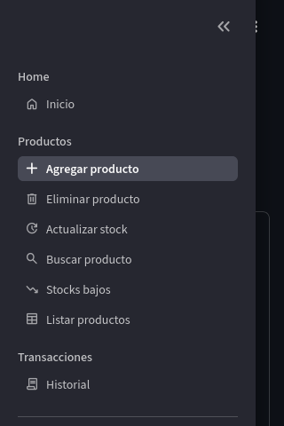
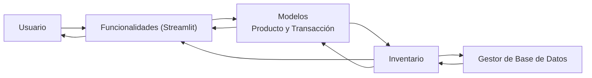
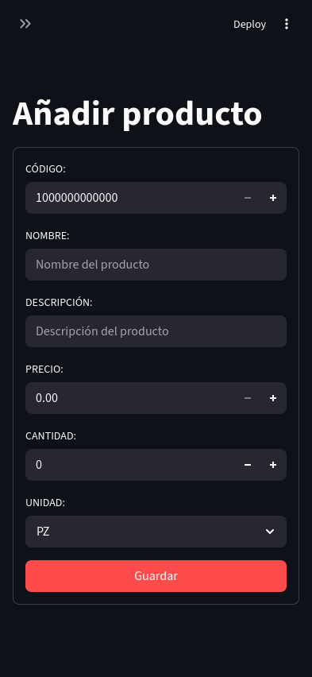
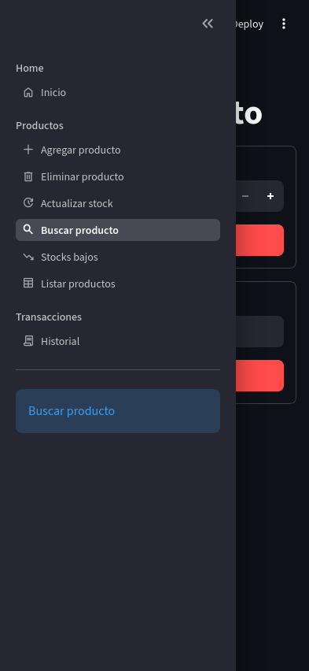
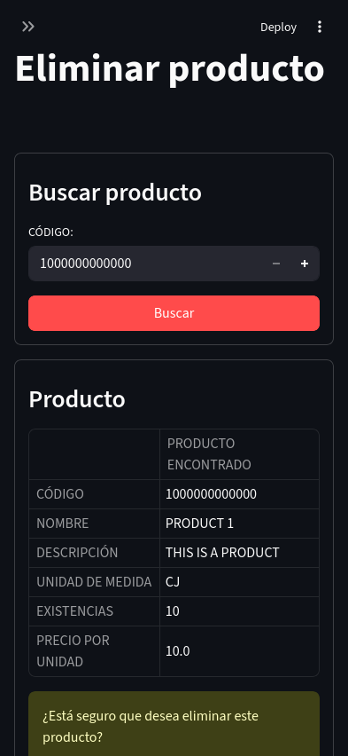
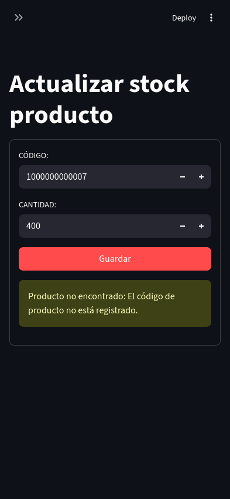
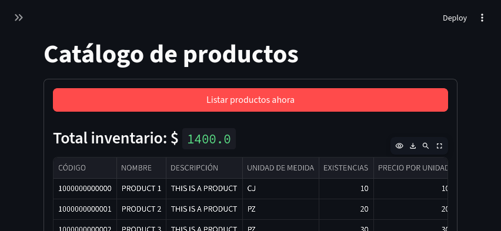
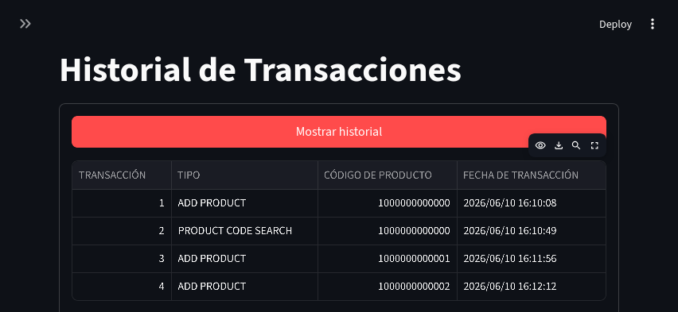

# Sistema de Inventario

Solución a *pequeñas* empresas que requieren tener un control de sus productos de forma **visual** y **atractiva**, eliminando la *dependencia* directa del uso de hojas de cálculo.

| Hoja de cálculo | Nuestra solución |
| :---:           | :---:            |
| Tiene costo     | Sin costo        |
| Conocimiento de hojas de cálculo | Intuitivo y sin experiencia |


> [!NOTE]
> Ambos procesos son manuales, la diferencia radica en la presentación y facilidad.

> [!TIP]
> Nuestra solución permite escalabilidad y facilidad, mientras las hojas son complementos, no sustituto de ellas.

Nuestra ayuda le facilitará realizar la transición de procesos manuales, como el uso de una libreta o de hojas de cálculo, a la preparación de usos de sistemas de ERP, aquí usted explora sin tanta complejidad y sin abrumadora cantidad de configuraciones y funciones. Esta es su solución definitiva o su escuela de preparación a sistemas ERP, lo importante es la mentalidad, no el conocimiento técnico de estos sistemas de inventarios.



## Capacidades del sistema

Nuestra solución posee las principales y adecuadas funciones iniciales, sin complejidad ni funciones que complican el uso:

- `Agregar producto`: Le despliega una interfaz intuitiva y visual para que usted rellene los campos del producto por agregar. Cualquier evento exitoso o inconviente con el guardado se le notificará con avisos de colores. No necesita tener un manual para identificar la gravedad del aviso, los colores le facilitará dicho trabajo y el mensaje es sencillo de comprender.

- `Eliminar producto`: Para facilitarle la *eliminación de un producto*, le proporcionamos este espacio para que a través del código del producto realice la acción sin complicaciones. Aquí no hay preocupación, usted no podrá eliminar ningún producto que tenga existencias y en toda situación, se le hará saber con avisos de colores.

- `Actualizar producto`: Un apartado que le permite mantener al día el stock de sus productos mediante el código y la cantidad de producto nuevo o vendido.

- `Buscar producto`: Una opción que interviene rápidamente en la búsqueda de un producto mediante dos criterios disponibles: **código** y **nombre** del producto.

- `Producto con stock bajo`: Cualquier producto con stock por debajo o igual a las *15 unidades* estará presente en esta lista. Aquí se le presenta la lista de sus productos con bajo stock en *formato de tabla* y lista para *descargar como de hoja de cálculo*.

- `Listar productos`: Le brinda la vista a los productos de su inventario, en formato de tabla, con todos los apartados disponibles. Aquí usted visualiza globalmente su repertorio, incluso incluye un cálculo del *total de su inventario* en dinero.

- `Historial de transacciones`: Cada transacción o movimiento realizado se queda guardado para su análisis y trazabilidad. Aquí es el lugar donde ver estos registros.

## Tech Stack

El gestor ha sido desarrollado empleando el lenguaje de programación **Python** como herramienta principal, se incorporó el motor de bases de datos **SQLite** con el *framework* **SQLite3** y para la interfaz de usuario, **Streamlit**.

## Arquitectura y Decisión de Diseño

Se implementó una arquitectura en **capas** (*UI, LÓGICA DE NEGOCIO, PERSISTENCIA*) para garantizar que la base de datos pueda ser sustituida en el futuro o añadir características globales progresivamente sin llegar a comprometer el sistema entero o la interfaz de usuario.



Este proceso de diseñó considerando evitar la situación del bloqueo del avance de cada funcionalidad por la dependencia entre ellas, y así avanzar en paralelo en cada capa sin importar el estado de cada una. En este caso particular, diseñamos **interfaces temporales** y asignamos una rama de trabajo por capas. Esto nos permitió aplicar el método de desarrollo desde arriba hacia abajo (**top-down**) empezando por la interacción del usuario, pasando por la lógica de negocio y por último, a la persistencia de datos. Gracias a esta manera de trabajar, se puede avanzar y generar un **desacople** de tal forma que la comunicación es dada por formatos de diccionarios. Esto permite desarrollar, implementar y testar para luego fusionar avances si el trabajo es correcto y funcional. 

## Instalación y configuración

Para instalar nuestra solución realiza los siguientes pasos:
                                                                              
1. Clona el repositorio:
```
git clone https://github.com/rosendocamal/inventory-system
```

2. Ingresa a la carpeta `inventory-system`, crea y activa dentro el entorno virtual:
```
python3 -m venv .venv && source .venv/bin/active
```

3. Instala **Streamlit**:
```
pip install streamlit
```

4. Instala **SQLite3**:
```
pip install sqlite3
```

5. En la carpeta raíz del repositorio (`inventory-system/`) ejecuta:
```
streamlit run main.py
```

En unos segundos se abrirá el navegador, por defecto la de su sistema (**Chrome**, **Firefox**, etc.), y el gestor de inventario estaría en funcionamiento. Si tienes abierto el navegador, tiene que buscar entre las aplicaciones abiertas o en segundo plano su navegador y una vez ahí, selecciona la pestaña de `Sistema de Inventario`.

## Guía de uso

Ubícate dentro `inventory-system/` y ejecuta:
```
streamlit run main.py
```

En unos segundos se abrirá el navegador, por defecto la de su sistema (**Chrome**, **Firefox**, etc.), y el gestor de inventario estaría en funcionamiento. Si tienes abierto el navegador, tiene que buscar entre las aplicaciones abiertas o en segundo plano su navegador y una vez ahí, selecciona la pestaña de `Sistema de Inventario`.








## Roadmap

> [!IMPORTANT]
> Si lo consideramos oportuno, las siguientes implementaciones se harán realidad.

- [] Importación y exportación de datos con formato **CSV** o similares.
- [] Empaquetar nuestra solución para su portabilidad y fácil instalación.
- [] Gestión de usuarios y mejora en los permisos y la seguridad de la información.

## Anédocta

Teníamos días sin tocar el proyecto por falta de voluntad, o por agenda ocupada. La única actualización o avance que necesitaba para culminar esta hazaña era un aspecto mínimo. Era migrar la capa de persistencia temporal de diccionarios en Python a una base de datos local. Preparado estaban las sentencias **SQL**, con guías y pasos, teníamos breve experiencia en **SQLite** y, habíamos experimentado y testado con el «framework», el código de la clase del gestor de base de datos estaba casi lista. Con cambiar la sintaxis y unas escasas modificaciones, pasar de diccionarios a una perduración de datos era trivial. O al menos, eso suponíamos aunque la evidencia de la falta de acción refutaba nuestra perspectiva. Planteamos manejar esta situación de manera poco ortodoxa, pero ajustado a las tendencias tecnológicas.

Utilizamos a **Gemini Flash**, en chatbot (lamentablemente), para esta encomienda. Le adjuntamos archivos de dos ramas distintas: el código de la clase del gestor de la base de datos (diccionarios, memoria temporal), de la clase de la lógica de negocio (inventario) y las sentencias SQL. En un «prompt», estructurado de manera básica, le indicamos leer la interconexión entre capas, interpretar lo que hace la gestión de diccionarios y las sentencias SQL, permitir la compatibilidad entre capas, utilizar las mejores prácticas modernas, sin incluir comentarios en el código ni intentos de interacción (conversación).

El código presentado quedó con un 90% de acierto, falló en no utilizar módulos adicionales para el **type hints** porque los empleó cuando se pidió lo contrario, algo fácil de resolver. El código fue sometido a escrutinio, **code review**, y pasó. ¿Qué aprendimos en ese código? No mucho, pero si breves detalles de cómo implementar algo o pormenores idiomáticos, difícil de aprender en tutoriales, fácil de aprender leyendo código ajeno. La realidad, la **IA** nos asistió solo esa parte. Dado la arquitectura por capas y la comunicación entre ellas por medio de diccionarios con un formato estandarizado y rígido, el desacople fue rápido y la migración a SQLite fue rápida.

## Licencia

El código se publica bajo licencia MIT. Consulta el archivo [LICENSE.](LICENSE)

## Autor

Proyecto desarrollado por **Rosendo Camal**.

Contacto:
+ [GitHub](https://www.github.com/rosendocamal)
+ [Linkedin](https://www.linkedin.com/in/rosendocamal)

